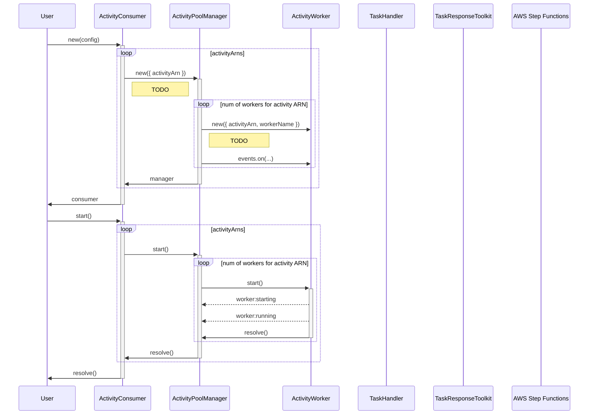
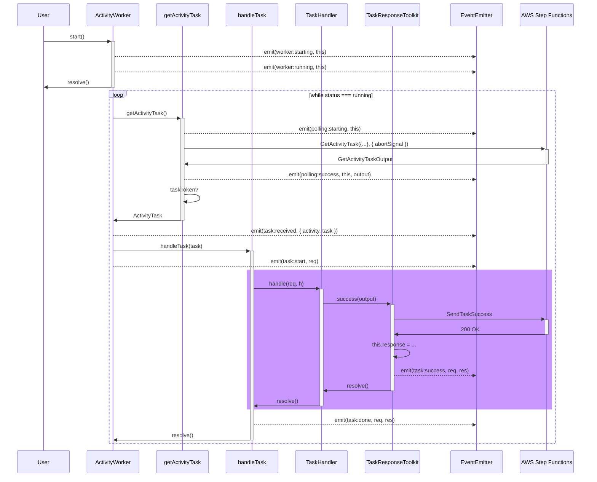

# Architecture

## Concepts

- ActivityConsumer: handles the lifecycle of the process which may involve 1 or more activity worker pools
- ActivityPoolManager: handles the lifecycle of 1 or more activity workers listening for events for an activity ARN
- [ActivityWorker](./src/worker/activity-worker.ts): uses a run loop to poll for an activity task and then executes the handler that was provided
- [TaskHandler](./src/worker/types.ts): a user-provided handler method that receives a TaskRequest and TaskResponseToolkit
- [TaskResponseToolkit](./src/worker/response.ts): provides a more JavaScript-esque interface for sending task heartbeats, success, and failures

## Startup

At constructor time the consumer initializes pools of activity workers based on the provided configurations. One pool will be responsible for a single activity ARN and will use one or more activity workers (based on the config) to handle that polling and task execution.

## Activity workers

When started, the activity workers use a run loop that will continuously poll for work until the worker's status changes from `running`. Polling is done by sending a `GetActivityRequest` command via long polling to AWS Step Functions to fetch an activity (if available) and then returns `null` if there is no taskToken in the response.

If there is a task, the worker creates a [TaskRequest](./src/worker/request.ts) and a [TaskResponseToolkit](./src/worker/response.ts), then invokes the provided handler with these two arguments. The handler **must** use the response's `success(output)` or `failure({ error, cause })` during invocation or the worker will throw its own [NoResponseSentError](./src/worker/errors.ts) exception.

### Events

Activity workers use an `EventEmitter` to communicate lifecycle events such as starting/stopping, polling, and task execution. The entire list of events can be found in [events.ts](./src/worker/events.ts) with three major categories of events: WorkerEvents, PollingEvents, and TaskEvents. All events are prefixed with one of `worker:` (for worker lifecycle), `polling:` (for polling lifecycles), or `task:` (for task lifecycles).

### Example Poll

### Shutdown

An activity worker will continue to poll until the status is no longer `running`. At that point the run loop will break out and the worker will change its status to `stopped`, emitting an event whilst doing so.

Primarily workers will terminate using the `stop()` method which will gracefully terminate, however multiple failed polls for activities may also result in the worker terminating its run loop and going to a `stopped` state. You can use the `exitOutput` to determine if it was a successful or errored exit.

When exiting, the worker uses an AbortSignal to cancel any in-flight polling from Step Functions, meaning workers should shutdown immediately if there is no task currently being handled (TODO: add an abort controller signal to the handler toolkit)
